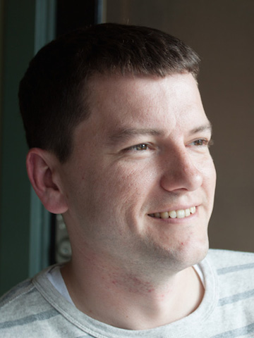

# Autumn 2014

###Course Description

This course provides an introduction to the design process that is central to HCI. It consists of a term-long group project, small individual assignments and readings, exams and presentations, and lectures.

###Basic Information

__Contact__: Email all instructors at cse440-instr [at] cs.washington.edu

__Class times & locations__: Tuesdays & Thursdays, 10:30-11:50am MOR 234

__Section times & locations__: Fridays, 10:30-11:30am CMU 228 or 3:30-4:30pm MGH 254

__Office Hours__: 

Scheduled hours are held most weeks, but check the calendar:

 - James - Tuesdays, 2:00 - 3:00, CSE 666 
 - Daniel - Thursdays, 12:00 - 1:00, CSE 218
  
Other meetings by appointment.

__Course Staff__:

<!--
I couldn't get this to format correctly, it would make everything after it render as HTML instead of markdown.
<table cellpadding="10">
<tr>
<td>
<image src="images/james_photo.jpg" alt="James Fogarty">
</td>
<td>
<image src="images/daniel_photo.jpg" alt="Daniel Epstein">
</td>
<td>
<image src="images/brad_photo.jpg" alt="Bradley Jacobson">
</td>
<td>
<image src="images/king_photo.jpg" alt="King Xia">
</td>
</tr>
<tr>
<td>
James Fogarty (course instructor)
</td>
<td>
Daniel Epstein (head teaching assistant)
</td>
<td>
Bradley Jacobson (teaching assistant)
</td>
<td>
King Xia (teaching assistant)
</td>
</tr>
</table>
-->

<!--
This display dominates the page, so I tried to add some spacing above. Maybe resizing the images instead would work?
-->

|| |||
|----------------------------------------|-------------------------------------------|------------------------------------------|----------------------------------|
|James Fogarty (course instructor)       |Daniel Epstein (head teaching assistant)   |Bradley Jacoboson (teaching assistant)    |King Xia (teaching assistant)     |

###Grading

The grading breakdown for this course is in flux, continue checking back for a more detailed summary. Points will be allocated in the following categories (which may change before instruction begins):

- Group Project
- Individual assignments and readings
- Exam
- Participation

###Course Project
This course centers around a term-long group project, in which you will go through the design process with a real idea. In this project, you will:

- Come up with an idea serving a group of people's technological needs
- Learn to design different styles and make tradeoffs among them
- Find real users, investigate their context of use, and test your interface designs within them.

This quarter's projects are themed on __Personal Informatics__, defined as follows:

> Personal informatics systems are systems that _help people collect personally relevant information for the purpose of 
> self-reflection and gaining self-knowledge._
>
> [Li _et al._, 2010](http://www.personalinformatics.org/lab/model/).

People are collecting more data about themselves through smartphone and desktop apps, automatically and manually. Your project should address a problem within current personal informatics tools to aid in data collection, self-reflection, or sensemaking.

We hope this course will allow you to create an open-ended design. Your project should __not__ re-create a solution that currently exists, and you should feel free to think beyond the current interaction techniques of mobile and desktop applications. This course is not about creating functional prototypes, but instead about design.